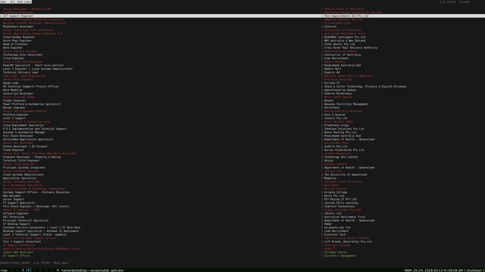

# Job Manager

Project to streamline applying to jobs on multiple sites.



Takes outputs from python files in job_finders and displays them in a curses-based frontend to organize and help apply for jobs, semi-autonomously generating cover letters.

This project was designed with ai in mind, obviously with the generating of cover letters, but also the general design of the project. The files in job_finders, are intended to be almost fully vibe coded, so the design of the project reflects quarantining mostly usupervised code and fails gracefully when ai messes up. The mojority of the rest of the project was also generated with ai, however this is higher trust code, as every line has been looked at and most have been refactored into a somewhat consistent codebase.

## Using This

First download the requireed packages
```bash
pip install -r requirements.txt
```

Also ensure that latex is installed with the command line utility `pdftexi2dvi` availible in your path 
Note that the example job finder "job_finders/scrape_seek.py", is not included with these instructions, I make no guarantee that this will be wokring, so I encorage the user to debug this if they are wanting to use this spesific script, more information about this can be found further down in this readme

Next create a `.env` file to store information:
```
OPENAI_API_KEY=your_key_here
RESUME_PATH=/path/to/resume.pdf
COVER_SAVE_PATH=/path/to/save/cover/letters
TERMINAL=[ Terminal app ]
EDITOR=[ Editor ]
FULL_NAME=Your Name
EMAIL=your@email.com
```
If you dont want to create cover letters than this step is unnecessary

The TERMINAL and EDITOR fields represent commands and arguments to be passed to subprocess, an example can be seen in example_env, currently supported formats for resumes are .pdf and .txt, i reccomend txt, as you can simplify the formating to reduce unnecessary tokens being used. The process of generating a cover letter is quite involved, this is intentional to reduce errors, and to give the usser an opportunity to personally evaluate the job listing and the generated cover letter.

finally simply run the manage_jobs.py script and get going
```bash
python manage_jobs.py
```

This will prompt the user to update the list of jobs, selecting yes will run the scripts in job_finders, at base only an example script for seek, i make no guarantee that this script will be working. If you want to update jobs, choose your favorite vibe coding product and get it to debug the example script or generate a new one. The only requirements for this is there be a function get and a variable QUERYS, the function should return a list of jobs in an list of python dictionaries in the format:
```
jobs = [{
    "reference_url": unique url for the job
    "job_title": title for the job
    "company": company
    "status": (optional) status of the job, defaults to pending, values can be [pending, excluded, applied]
}]
```
The variable QUERYS, represents variables to be passed to get. this is in the form of a list of lists to be unpacked with *keys. For example if get had one argument url, QUERYS could look like:
```
QUERYS = [
    [url1],
    [url2],
    [url3],
]
```
This design was chosen to make the program agnositic to whatever programing choices an ai agent might make when designing a script.
