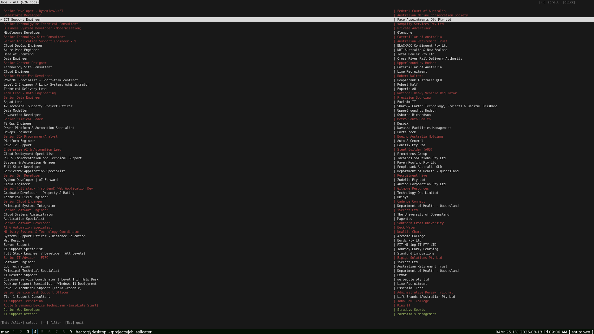

# Job Manager

Project to streamline applying to jobs on multiple sites.



Takes outputs from python files in job_finders and displays them in a curses-based frontend to organize and help apply for jobs, semi-autonomously generating cover letters.

This project was designed with ai in mind, obviously with the generating of cover letters, but also the general design of the project. The files in job_finders, are intended to be almost fully vibe coded, so the design of the project reflects quarantining mostly usupervised code and fails gracefully when ai messes up. The mojority of the rest of the project was also generated with ai, however this is higher trust code, as every line has been looked at and most have been refactored into a somewhat consistent codebase.

## Using This

First download the requireed packages
```bash
pip install -r requirements.txt
pip install anthropic libsql selenium requests beautifulsoup4
```
The second line covers packages not yet listed in requirements.txt, `anthropic` for cover letters, `libsql` for the database, and the rest for the example job finders.

Also ensure that latex is installed with `pdflatex` availible in your path
Note that the example job finder "job_finders/scrape_seek.py", is not included with these instructions, I make no guarantee that this will be wokring, so I encorage the user to debug this if they are wanting to use this spesific script, more information about this can be found further down in this readme

Next create a `.env` file to store information:
```
ANTHROPIC_API_KEY=your_key_here
RESUME_PATH=/path/to/resume.pdf
COVER_SAVE_PATH=/path/to/save/cover/letters
TERMINAL=[ Terminal app ]
EDITOR=[ Editor ]
FULL_NAME=Your Name
EMAIL=your@email.com

TURSO_URL=libsql://your-db.turso.io
TURSO_TOKEN=your_token_here
```
If you dont want to create cover letters than the ANTHROPIC_API_KEY is unnecessary, and if you only ever use this on one machine the two TURSO fields can be left out entirely

The TERMINAL and EDITOR fields represent commands and arguments to be passed to subprocess, an example can be seen in example_env, currently supported formats for resumes are .pdf and .txt, i reccomend txt, as you can simplify the formating to reduce unnecessary tokens being used. The process of generating a cover letter is quite involved, this is intentional to reduce errors, and to give the usser an opportunity to personally evaluate the job listing and the generated cover letter.

finally simply run the manage_jobs.py script and get going
```bash
python manage_jobs.py
```

## Using It On More Than One Machine

The job list lives in a sqlite database, `jobs.db`. Left alone that file just sits on
whatever machine you ran it on. Fill in TURSO_URL and TURSO_TOKEN and it becomes a
local replica of a database hosted on [Turso](https://turso.tech) instead, so the same
job list follows you between machines. Make a database with their cli:
```bash
turso db create jobs
turso db show jobs --url
turso db tokens create jobs
```

Pick a region near you when you create it. Everything is still read locally so reads
are unaffected, but the sync round trip is a real network call and a database on the
other side of the world makes it slower than it needs to be.

The first run after filling in those fields migrates whatever is already in `jobs.db`
up to the cloud. Nothing is destroyed doing this, the old file is renamed to
`jobs.db.pre-turso.bak` and left alone. On any other machine there is nothing to do,
just clone the repo, copy your `.env` across and run it, the database is pulled down on
startup.

Cover letters are **not** stored in the database, they stay as .tex files in
`.cover_letter_backup` and only exist on the machine that generated them.

### How the syncing behaves

Reads and writes both hit the local replica, so the interface stays instant even on a
bad connection. Syncing happens at three points, on startup to pull down anything the
other machines did, after a scrape, and on exit to push up whatever you changed. It goes
both directions each time.

A sync is never abandoned halfway. Ctrl-C, `kill`, or closing the terminal all still
flush your changes up before the program dies. Even a `kill -9` costs you nothing,
writes are committed to the local replica immediately and go up on the next sync, so the
worst case is your changes are late rather than lost.

The one case needing repair is if a machine is hard killed while holding changes it
never pushed, and you then use a different machine before going back to it. That replica
has drifted from the server and its next sync gets rejected. This is detected and
repaired automatically, the replica is rebuilt from the server and your local changes are
replayed over the top, so a status you set locally wins. The pre-repair file is kept as
`jobs.db.conflict-<timestamp>.bak` rather than deleted, in case you want to go digging.

Being one person on a couple of machines, the last-write-wins behaviour is fine. Two
people sharing a database and triaging the same job at the same time would want
something better thought out than this.

This will prompt the user to update the list of jobs, selecting yes will run the scripts in job_finders, at base only an example script for seek, i make no guarantee that this script will be working. If you want to update jobs, choose your favorite vibe coding product and get it to debug the example script or generate a new one. The only requirements for this is there be a function get and a variable QUERYS, the function should return a list of jobs in an list of python dictionaries in the format:
```
jobs = [{
    "reference_url": unique url for the job
    "job_title": title for the job
    "company": company
    "status": (optional) status of the job, defaults to pending, values can be [pending, excluded, applied]
    "posted_at": (optional) ISO 8601 timestamp of when the job was posted on the source site
}]
```
The variable QUERYS, represents variables to be passed to get. this is in the form of a list of lists to be unpacked with *keys. For example if get had one argument url, QUERYS could look like:
```
QUERYS = [
    [url1],
    [url2],
    [url3],
]
```
This design was chosen to make the program agnositic to whatever programing choices an ai agent might make when designing a script.
